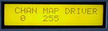

# 64 or 128 Output Driver Board

The 64 or 128 Output Driver MIDItools® one of our best sellers.This MIDItool allows you to manipulate up to 128 high current darlington transisitor drivers using MIDI Note On messages received on the same channel. The 64 or 128 Output Driver is commonly used to drive relays and/or solenoids for sequenced multimedia shows.

The 64 or 128 Output Driver requires a rack-mount chasis to accomodate one or two expansion boards. The The 64 Output Driver application requires one expansion board whereas the 128 Output Driver app requires two expansion boards.

[8 Maps](../manuals/opsmaps.pdf) are provided to assign specific MIDI Note numbers to specific drivers. [Instruction manual](../manuals/00259opd.pdf) included.

It's a blast!

*Mouse over the buttons, LEDs, and potentiometer to see what they do.*
 **HOW DO I...**

...CONNECT THE EQUIPMENT?
Connect the relays, etc., to the multipin connector(s). Connect the external power supply to the two large circular pads on the expansion PCB(s).

...SET THE GLOBAL MIDI RECEIVE CHANNEL?
Press the CHAN key. The global receive channel is selected using the +/- key and/or the VALUE fader. The device will continue to respond to MIDI Note On commands. The default channel is 1.

...SAVE THE DEVMAP AND CHANNEL?
Press the SAVE key. Both parameters are stored in nonvolatile EEPROM and will be recalled at powerup. When storing values, LED \#3 blinks.

...LOCK THE DISPLAY?
Pressing the LOCK key prevents any parameter changes from taking place unless the channel or map buttons are pushed.

...USE NOTE MESSAGES TO AUTOMATICALLY TRIGGER RELAYS?
A Note On message (with nonzero velocity) will energize (pull the output to external ground) the driver corresponding to the note number. A Note Off message (Note On message with velocity 0), will deenergize (open the output of) the driver.

...RESET THE DRIVERS?
Press the ALLOFF key. All drivers will return to their deenergized state. At power up all drivers are deenergized.

**LCD Screen:**

