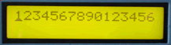

# Channel Filter

The Channel Filter lets you select which MIDI channel data will pass thru from its MIDI IN to its MIDI OUT. Use this MIDItool to select which MIDI channel data will make it to a device, or moniter which channels a device is receiving by watching the corresponding LEDs. Filter our all channel messages, or protect a device with a global channel setting.

*Mouse over the buttons, LEDs, and potentiometer to see what they do.*
 **HOW DO I...**

**...SELECT A CHANNEL FILTER?**
A filter is selected using the SELECT \<-/-\> keys. Sixteen independent channel filters are available. The LCD cursor underlines the selected filter.

**...ENABLE OR DISABLE THE SELECTED FILTER?** Press the STATUS OnOff key to enable or disable the selected filter. When the filter is enabled, all messages received on that channel will be rejected (i.e. not transmitted out the MIDI OUT port).

**...DISABLE ALL FILTERS?** Pressing the STATUS CLEAR key disables all filters.

**...MONITOR THE STATUS OF ALL FILTERS?** Filter status is given in the LCD. An asterisk (\*) under the filter number indicates that the filter is enabled.

**...MONITOR THE RECEIVED DATA STREAM?** Incoming data is monitored with the LEDs. If a message is received on the appropriate channel, the LED lights, regardless of the status of the filter.

**...ENABLE THE DATA HOLD DISPLAY?** Press the LEDs HOLD key. The LEDs will light and stay lit when a matching message is received. Pressing the key again clears the LEDs without leaving this mode.

**...ENABLE THE FREE RUNNING DISPLAY?** Press the LEDs FREE key. After turning off all LEDs, the appropriate LED will blink when a matching message is received.

**LCD Screen:**



The cursor underlines the filter that will be modified
by the STATUS OnOff key.

```
|1234567890123456|
| * * * *|
```
\*=filter enabled
