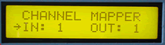

# Channel Mapper

The Channel Mapper remaps incoming MIDI messages to another channel, and then sends them out. The Channel Mapper expands the MIDI capabilites of older synths that send only on one channel by allowing them to send to other channels as well. Remap drum channel 10. Experiment with your seqencer arrangements by assigning intruments to channels and then quickly changing them to see how the new arrangement sounds...

*Mouse over the buttons, LEDs, and potentiometer to see what they do.*
 **HOW DO I...**

**...SELECT THE CHANNEL TO MAP?**
Press the CHANNEL IN key. The channel to be mapped is selected using the +/- keys and/or the VALUE fader.

**...SELECT THE NEW CHANNEL?**
Press the CHANNEL OUT key. The new channel isselected using the +/- keys and/or the VALUE fader.

**...OPERATE THE MAPPER?**
All messages on the IN channel are retransmitted onthe new OUT channel. Data bytes are not modified.The DATA MAPPED LED lights when data are being mapped.

**LCD Screen:**



The cursor arrow points to the parameter that will be modified by the +/- keys and VALUE fader.

\| CHANNEL MAPPER \| where nn=1-16
```
| IN:nn OUT:nn |
```
