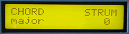

# Chord Player

The Chord Player provides a chordal accompaniment to a single melodic line. The chords can be strummed or arppegiated, up or down. Create melodies with accompaniment or generate strange effects by playing more than one note at a time. Major, Minor, Major 7th, Minor 7th, Dominant 7th, Major 9th, Minor 7th + 9th, and Major 7th + 9th chords can be generated.

*Mouse over the buttons, LEDs, and potentiometer to see what they do.*
 **HOW DO I...**

**...SELECT A CHORD TYPE?**
The chord type is selected with the appropriate key. Available chords types are: MAJOR, Major 7th (MAJ 7), Dominant 7th (DOM 7), Major 9th (MAJ 9), MINOR, Minor 7th (MIN 7), Minor 7th+9th (MIN79), and Major 7th+9th (MAJ79).

**...SIMULATE A GUITAR STRUM OR PIANO ARPEGGIO?**
The time between each note in the chord can be set using the STRUM fader. A minimum setting simulates a piano chord (all notes are played simultaneously); a maximum setting simulates a slow guitar strum. Notes play from the lowest (root) note of the chord to the highest.

There is a special strum mode available when the STRUM value is between 16-31. In this range, the downward strum occurs with the received Note On message. When, the key is released, an upward strum is generated at a velocity slightly less than the downward strum. This upward strum is played in half the selected STRUM time. When the upward strum is finished, the chord is immediately turned off.

**...PLAY CHORDS USING THIS PLAYER?**
The chord begins playing when a root note message is
received. The CHORD and STRUM settings are displayed
in the LCD.

All non-note messages are merged with any generated note messages (e.g. controllers, timing clock, etc.)

**...SET MY MASTER CONTROLLER FOR PROPER OPERATION?**
This device should be controlled using a monophonic (one note at a time) controller or technique. It is not meant for polyphonic input except for special effect purposes.

**LCD Screen:**



```
|CHORD STRUM|
|xxxxxxxxxx mmm |
```
where xxxxxxxxxx="major",
"minor", "dominant 7",
"major 7", "minor 7+9",
"minor 7", "major 7+9", or
"major 9", mmm=0-255
