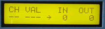

# Controller Mapper

The Controller Mapper transforms incoming controller messages into controller messages of a different type and sends them out its MIDI OUT. Imagine controlling a slave's volume (controller 7) with a foot pedal or mod wheel from a master controller. Or mapping pan to pitch bend? Use the Controller Mapper as a diagnostic tool to find out which controllers a device will respond to.

*Mouse over the buttons, LEDs, and potentiometer to see what they do.*
 **HOW DO I...**

**...SELECT A CONTROLLER TO MAP?**
Press the CONTROLLER IN key. The controller to be mapped is selected using the +/- keys and/or the VALUE fader.

**...SELECT THE NEW CONTROLLER?**
Press the CONTROLLER OUT key. The new controller number is selected using the +/- keys and/or the VALUE fader.

**...OPERATE THE MAPPER?**
All messages of the IN controller number are retransmitted as the new OUT controller. Data bytes are not modified. The DATA MAPPED LED lights when data are being mapped. The last mapped message's channel and value are displayed.

**LCD Screen:**



The cursor arrow points to the parameter that will be modified by the +/- keys and VALUE fader.

\|CH VAL IN OUT\| where nn=1-16, bbb=0-127
```
|nn bbb bbb bbb|
```
