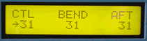

# Controller Thinner

The Universal Transmitter transmits any one, two, or three byte message to receiving devices. You Here's a MIDItool Craig Anderton uses in his personal studio to thin controller messages flowing from his digital mixer. The Control Thinner prevents crashes and timing problems caused by too much controller information. Select the type of controller message you want to thin (up to 3 types can be thinned at a time), and then set how much thinning to apply. Use the Controller Thinner to limit the controller data going into or out of a sequencer, troubleshoot a malfuntioning device, or thin data genterated by a guitar or wind controller.

*Mouse over the buttons, LEDs, and potentiometer to see what they do.*
 **HOW DO I...**

**...SELECT A MESSAGE TYPE FOR THINNING?**
Select a message type with the MESSAGE TYPE keys: CTL (controllers 0-63), BEND (pitch bend), or AFT (channel and key aftertouch).
**
...SET THE AMOUNT OF THINNING FOR EACH MESSAGE TYPE?**
The amount of thinning prodcued for the selected message type is set using the +/- keys and/or the VALUE fader.

**...OPERATE THE THINNER?** ;
All controller messages are thinned and retransmitted according to the assigned thinning amount, M. If M=0, every message is thinned (rejected). If M=31, every 32nd message of that type is thinned (rejected). For any valid value of M, every M+1 message is rejected. M represents the number of messages that will be passed before one message is rejected.

Thinning is channel independent.

**...BYPASS THE THINNER?**
Press the BYPASS keys: CTL, BEND or AFT. Thinning of that message type will be disabled. The appropriate BYPASS LED will light. Pressing the BYPASS key again enables thinning and turns the LED off.

**LCD Screens:**



The cursor arrow points to the parameter that will be
modified by the +/- keys and VALUE fader.

\|CTL BEND AFT\| where nn=0-31
```
| nn nn nn|
```
