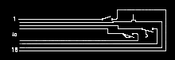
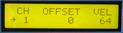

# Custom Instrument

The Custom Instrument integrates up to 64 switches to create a custom MIDI controller. This MIDItool requires an [expansion board](../images/custinst.gif) to host extra logic and sockets to connect the switches. Any kind of normally open momentary switch can be used, from simple push-button types to photodetectors, reed switches, infrared, motion detector, tilt switches...

The Custom Instrument is a favorite tool of Cyberartists-- imagine being able to trigger a note or melody by touching a spot on your body or stepping various places on the floor. Create a master controller for samplers or sound modules. Convert an analog keyboard into a MIDI keyboard...

*Mouse over the buttons, LEDs, and potentiometer to see what they do.*
 **HOW DO I...**

**...SET THE TRANSMIT CHANNEL?**
Press the SETUP CHAN key. The MIDI transmit channel
is set with the +/- keys and/or the VALUE fader.

**...SET THE NOTE NUMBER OFFSET?**
Press the SETUP OFSET key. The note number offset for all note messages is selected using the +/- keys and/or VALUE the fader.

**...SET THE VELOCITY FOR ALL NOTES?**
Press the SETUP VEL key. The velocity for all Note On messages is set with the +/- keys and/or the VALUE fader.

**...CONNECT THE SWITCHES?**
Each 16-pin connector on the Custom Instrument board provides an input path for 8 switches. The switches should be connected via a ribbon cable, with a 16-pin male socket on one end to the expansion board. The switch contacts (normally open) should be connected to the other end of the ribbon cable between wires 1 and 16, 2 and 15, 3 and 14, etc.

**LCD Screen:**

The cursor arrow points to the parameter that will be ;
modified by the +/- keys and VALUE fader.

\| CH OFFSET VEL\| where nn=1-16, bbb=0-127,
\| nn ssss bbb\| ssss=-128 to 127
