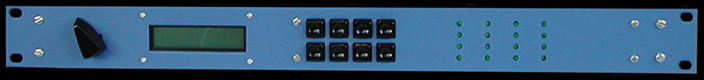
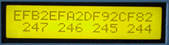

# CV-to-MIDI

The CV-to-MIDI MIDItool translates four analog voltages into four selectable MIDI continuous controllers. This is done by connecting four analog control voltages (0-5v) to four ADC (Analog to Digital Converter) inputs on the MIDItools® CPU board. The digitized voltages are mapped to MIDI controller messages according to the controller parameters set (voltage source, MIDI channel, and MIDI controller number). Imagine controlling pitchbend with a photo-transistor or volume with a pressure sensor!

Althoughth this MIDItool does not require an expansion board, it does require special construction techniques to connect the control voltage inputs. This project should be built in a rack-mount platform to allow the inputs to be connected via 1/4" jacks. [Assembly manual](../i/manuals/01326-AS.pdf), [connection diagram](../i/manuals/01326-CD.pdf), [sample circuits](../i/manuals/01323.pdf) and expansion kit are all included.

*Mouse over the buttons, LEDs, and potentiometer to see what they do.*
 **HOW DO I...**

**...SET THE TRANSMIT CHANNEL FOR EACH CONTROLLER?**
Press the PARM key until the underline cursor is under the desired Transmit Channel parameter. Press the +/- key to set the desired channel: 1-16.

**...SET THE CONTROLLER NUMBER FOR EACH CONTROLLER?**
Press the PARM key until the underline cursor is under the desired controller number parameter. Press the +/- key to set the desired controller number: 0-127.

**...SELECT THE ANALOG VOLTAGE FOR EACH CONTROLLER?**
Press the PARM key until the underline cursor is under the desired voltage parameter. Press the +/- key to select the desired analog votage source: 1-4.

**...DISABLE THE TRANSLATION FOR A GIVEN CONTROLLER?**
Press the DISABLE/ENABLE key (Tog1, Tog2, Tog3, and Tog4) for the desired controller. Press again to enable the translation.

**...SAVE ALL PARAMETERS?**
Press the SAVE key. All translation parameters are saved to nonvolatile EEPROM. They will be recalled at powerup.

**...OPERATE THE DEVICE?**
Four control voltages (0-5VDC) are connected to the four ADC inputs (ADC0-ADC3). The digitized voltages are mapped to MIDI controller messages according to the controller parameters set (voltage source, MIDI channel, and MIDI controller number). Incoming MIDI messages are ignored. Running status is implemented.

**LCD Screen:**



```
|CNNVCNNVCNNVCNNV|
|XDataXDataXDataXData|
```
C = MIDI Tranmit Channel (0H-FH), corresponding to MIDI channels 1-16.
NN = MIDI Controller Number (00H-7FH), corresponding to controllers 0-127.
V = Voltage Source (1-4).
X = Controller Disable Indicator ("\>" = DISABLE).
Data = MIDI Controller Data Transmitted (0-127)
