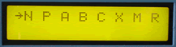

# Data Filter

The Data Filter looks at all MIDI IN messages and passes or rejects specific types of messages chosen by the user. Note messages, program change, controller, system common, system exclusive, poly pressure, mono pressure and picthbend can be filtered out on all channels.

Use the Data Filter to filter aftertouch data to a sequencer, filter out clock signals to a drum machine, double a MIDI channel by filtering out specific data to a device sharing a MIDI channel, eliminate all messages except sync between a computer sequencer and keyboard sequencer, or monitor messages with the on board LEDs.

*Mouse over the buttons, LEDs, and potentiometer to see what they do.*


**HOW DO I...**

**...SELECT A DATA FILTER?**
A filter is selected using the SELECT \<-/-\> keys. Eight independent data filters are available. The LCD cursor arrow points at the selected filter.

The following data filters are available:

LCD Code Message(s) Filtered
-----------------------------
N Note On and Note Off
P Program Change
A Channel and Key Aftertouch
B Pitch Bend
C Control Change (incl. Mode Messages)
X System Exclusive
M System Common
R System Realtime
**
...ENABLE OR DISABLE THE SELECTED FILTER?**
Press the STATUS OnOff key to enable or disable the selected filter. When the filter is enabled, all messages received of that type will be rejected (i.e. not transmitted out the MIDI OUT port).
**
...DISABLE ALL FILTERS?**
Pressing the STATUS CLEAR key disables all filters.
**
...MONITOR THE STATUS OF ALL FILTERS?**
Filter status is given in the LCD. An asterisk (\*) under the filter code indicates that the filter is enabled.**

...MONITOR THE RECEIVED DATA STREAM?**
Incoming data is monitored with the LEDs. If a message is received that matches the filter type, the appropriate LED lights, regardless of the status of filter status.
**
...KNOW WHEN THE DATA BUFFER OVERFLOWS?**
The OVERFLOW LED indicates when the MIDI receive buffer is full. Data errors may occur.
**
...ENABLE THE DATA HOLD DISPLAY?**
Press the LEDs HOLD key. The LEDs will light and stay lit when a matching message is received. Pressing the key again clears the LEDs without leaving this mode. **

...ENABLE THE FREE RUNNING DISPLAY?**
Press the LEDs FREE key. After turning off all LEDs, the appropriate LED will blink when a matching message is received.

**LCD Screen:**



The cursor arrow points to the filter that will be
modified by the STATUS OnOff key.

\| N P A B C X M R\| \*=filter enabled
```
| * * * *|
```
