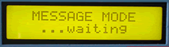

# Data Monitor

The Data Monitor monitors the MIDI stream in two modes: Data and Channel. In data mode, the MIDI messages coming down the pipe area displayed on the LCD in the order they are received. An LED corresponding to the message type lights immediately afterwards. In Channel mode, the LCD again displays the message, but the LEDs indicate which channel the MIDI messages are traveling on. The LEDs can be latched or unlatched.

The Data Monitor makes a great general-purpose MIDI monitor, as well as serving as a system troubleshooter. Verify the transmission of all types of data, from simple note messages to MIDI clocks.

*Mouse over the buttons, LEDs, and potentiometer to see what they do.*
 **HOW DO I...**

**...SELECT THE MESSAGE MONITOR CHANNEL(S)?**
Press the SETUP CHAN key. The monitor channel is selected using the +/- keys and/or the VALUE fader (rack unit only). To monitor ALL channels simultaneously, use the +/- keys to select one above channel 16 or two below channel 1. To monitor System Messages only, use the +/- keys to select two above channel 16 or one below channel 1 (LCD shows "NONE").
**
...MONITOR MESSAGES?**
Press the MODE MSG key. Message LEDs will light for each occurrence of that MIDI message on the selected message monitor channel(s). If no channels are selected, only System Messages will be displayed.
Message LEDs include: Note on (nton), note off (noff), channel aftertouch (chaf), key aftertouch (kyaf), program change (prog), pitch bend (bend), control change (cntl), channel mode (mode), song position pointer (spp), song select (song), system exclusive (sysx), active sensing (sens), start, stop, continue (cont), and timing clock (clk).

The LCD gives information for the last message received. Timing Clock and Active Sense Messages are not displayed in the LCD.

**...MONITOR MESSAGE CHANNELS?**
Press the MODE CH key. Channel LEDs will light when messages are received on that channel, regardless of which channel has been selected for message monitoring.
**
...ENABLE THE DATA HOLD DISPLAY?**
Press the LEDs HOLD key. The LEDs will light and stay lit when a matching message is received. Pressing the key again clears the LEDs without leaving this mode.

**...ENABLE THE FREE RUNNING DISPLAY?**
Press the LEDs FREE key. After turning off all LEDs, the appropriate LED will blink when a matching message is received.

**LCD Screen:**



When selecting a channel to monitor,

\| MESSAGE MODE \| where nnnn=1-16, "ALL " or
\| Channel: nnnn \| "NONE"

When monitoring channels,

```
| CHANNEL MODE |
```\| ...monitoring

When waiting for the first message in message mode,

```
| MESSAGE MODE |
| ...waiting |
```
If the MIDI receive buffer fills up,

```
|*** WARNING *** |
|Buffer Overflow |
```
When messages are received in message mode,

```
|TYPE CH KEY VEL| |TYPE CH KEY VEL|
|NtOff nn bbb bbb| |NtOn nn bbb bbb|
```
```
|TYPE CH KEY VAL| |TYPE CH NUM VAL|
|KyAft nn bbb bbb| |Cntrl nn ccc bbb|
```
```
|TYPE CH NUM | |TYPE CH VAL |
|Prgrm nn bbb | |ChAft nn bbb |
```
```
|TYPE CH MSB:LSB| |TYPE CH STATUS |
|PBend nn bbb:bbb| |RsCtl nn ttttt |
```
```
|TYPE CH STATUS | |TYPE CH STATUS |
|Local nn yyyyy | |AlOff nn ttttt |
```
```
|TYPE CH STATUS | |TYPE CH STATUS |
|OmOff nn ttttt | |OmOn nn ttttt |
```
```
|TYPE CH NUM | |TYPE CH STATUS |
|MonOn nn ee | |PlyOn nn ttttt |
```
```
|TYPE TY VAL | |TYPE MSB:LSB |
|MTC a dd | |SPosP bbb:bbb |
```
```
|TYPE NUM | |TYPE |
|Song bbb | |Tune Request |
```
```
|TYPE | |TYPE |
|SysEx EOX | |Start |
```
```
|TYPE | |TYPE |
|Continue | |Stop |
```
```
|TYPE | |TYPE |
|System Reset | |System Exclusive|
```
```
|TYPE HEX |
|Undefined hhh |
```
where nn=1-16, bbb=0-127, ccc=0-120, hh=00H-FFH,
yyyyy="ON", "OFF" or "undef", ttttt="OK" or "undef"
a=0-7, dd=0-15, ee=0-16
