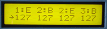

# Keyboard Mapper

The Keyboard Mapper maps a MIDI controller's note messages to one, two or three channels according to the note's velocity or number. This enables range splitting of the downstream MIDI devices by assigning different voices to different channels.

Velocity splitting can create dynamic sounds by assigning a different articulated patch to each velocity range. For example, a veloctiy below 90 could trigger a softly hit drum, 90-120 a medium drum and greater than 120 a loud drum.Use the Keyboard Mapper to enhance inexpensive keyboards, layer voices, eliminate note ranges, or enhance effects devices.

*Mouse over the buttons, LEDs, and potentiometer to see what they do.*
 **HOW DO I...**

**...SET ZONE BOUNDARIES?**
Zone boundaries are selected by pressing the ZONE BOUNDARIES keys: Z1-E(nd), Z2-B(eginning), Z2-E or Z3-B. Boundary values are then set with the +/- keys and/or VALUE fader.

Zone boundaries are constrained to 0-127. They are defined as follows:

ZONE BEGINNING END
1 0 Z1-E
2 Z2-B Z2-E
3 Z3-B 127
**
...SET THE OPERATING MODE?**
Zones values are assigned to one of two parameter groups: Note Numbers or Velocities. The "mode" is selected using the NOTE and VEL keys. The appropriate MODE LED lights.
**
...OPERATE THE MAPPER?**
In either mode, notes received on channel N are retransmitted on channels assigned to each zone, as follows:

ZONE CHANNEL
1 N
2 N+1
3 N+2

Each zone is considered independently. If the mode parameter value is within the zone's boundaries, it will be retransmitted on that zone's channel. **

...KNOW IF THE DATA BUFFER OVERFLOWS?**
If the receive data buffer becomes full, the OVERFLOW LED will light until the device is reset.

**LCD Screen:**



The cursor arrow points to the parameter that will be
modified by the VALUE +/- keys and VALUE fader.

\| 1:E 2:B 2:E 3:B\| where ccc=0-127
```
| ccc ccc ccc ccc|
```
