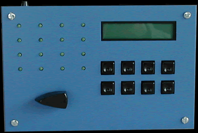
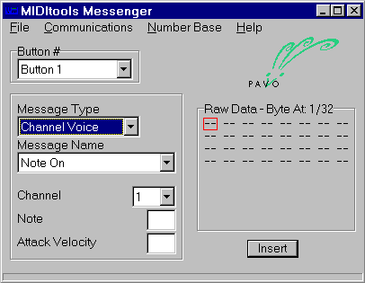

# MIDItools Messenger

The MIDItools® Messenger allows the user to create a custom MIDI device by programming the eight push buttons on the MIDItools® computer. MIDI messages are configured and assigned to a button via a Windows application and then are downloaded to the MIDItools® computer over a MIDI cable. The programmed message is transmitted from the MIDI out of the MIDItools® box when the selected button is pushed. Any MIDI message can be assigned to any push button as long as the message does not exceed 32 bytes.

<div>

Some possible uses for the MIDItools® Messenger are:

- <div>

  Sequencer Remote Control. Program the buttons of the MIDItools® computer to Start, Stop, Continue, Change Tempo, Mute or Rewind.

  </div>

- <div>

  Program Changer. Select program changes remotely.

  </div>

- <div>

  Control Change Messenger. Set or change controller values.

  </div>

- <div>

  System Exclusive Messenger. Send device-specific system exclusive messages to your instruments. (Including effects and sound-parameter changes).

  </div>

- <div>

  Custom Instrument. Play notes and chords from a distance. Use alternative switches.

  </div>

- <div>

  MIDI Show Controller. Send MIDI Show Control messages.

  </div>

- <div>

  MIDI Machine Control Messenger. Send MIDI Machine Control messages.

  </div>

- <div>

  RPN or NRPN messenger.

  </div>

- <div>

  Tool for learning MIDI programming. The MIDItools® messenger graphical user interface displays the hexidecimal and decimal representations of the selected messages. Students learn how MIDI messages are formatted and/or how to format system exclusive messages.

  </div>

- <div>

  MIDI message editor. Edit and test programmed MIDI messages or test device response to MIDI messages.

  </div>

<div>

*Mouse over the buttons,LEDs, and potentiometer to see what they do.*

</div>

</div>



Operating the MIDItools® Messenger:

1\. Assign the MIDI message you want to send to a push button on the MIDItool by selecting button 1 - 8 from the Button \# field.

2\. Configure your message by selecting the Message Type, Message Name and typing in any non-selectable parameters in the Message box. Then click the Insert button. Your message is now stored in the "send queue" and is displayed in the Raw Data Byte box. You can view your data either in base 10 or hexadecimal by selecting your preferred view in the Number Base pull-down menu. If you make a mistake you can click on the byte you wish to change in the Raw Data Byte box and type in a new value.

3\. Once you have assigned your MIDI messages to the buttons, download the assignments to the MIDItool by connecting a MIDI cable between the PC and MIDItools® and selecting Send from the Communications pull-down menu. You will see an indicator bar at the bottom of the application showing the data bytes being sent. When the download is complete the buttons on the MIDItool are programmed to send the MIDI messages you have specified.

4\. To view the contents of each button, turn the fader on the MIDItools® box. The LCD scrolls through messages 1 through 8 and displays the hexadecimal value for each byte programmed. Note: Any data bytes not specifically programmed will be filled with the F4H byte and are ignored by the MIDItools® CPU. If high-resolution timing placeholders are needed, each F4H byte takes 1mS.

5\. To save the device you have created select Save Set from the File menu. Type in the name of your new MIDItool and it will be saved with the suffix .mms. To reopen the set, double-click its icon. Once opened, click on red data box to view the message types saved.

6\. To clear the values in the application, MIDItool, or both use the Clear Values option in the Communications menu bar.

7\. To send the MIDI messages you have programmed to your MIDItools® simply press the corresponding button on the MIDItools® box. The messages are sent from the MIDI Out of the MIDItool.



LCD Screen:


```
| M B H |
| X X X |
```
M = message corresponding to button number.
B = byte in message.
H = value of byte.
