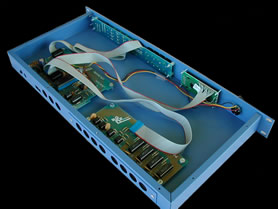
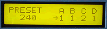

# MIDI Patch Bay


The MIDI Patch Bay to connects four seperate MIDI INs to four MIDI OUTs, and stores 16 different programmed configurations. This MIDItool requires the Patch Bay expansion board. MIDI merging is not supported.

Use the Patch Bay to store different preset combinations of master/slave keyboards, route devices to a system exclusive librarian, or set up assignments for controllers to control different signal or effects processors.

*Mouse over the buttons, LEDs, and potentiometer to see what they do.*
 **HOW DO I...**

**...CREATE A DESIRED PATCH?**
Press the desired OUTPUT key (A,B,C or D). Select the desired input port with the +/- keys and/or the VALUE fader. A "\*" next to the preset number indicates that the preset patch has been modified. Patches are indicated on the LCD and the LED display.
**
...STORE A CREATED PATCH AS A PRESET?**
Press the PRESET STORE key. Use the +/- keys and/or the VALUE fader to select the desired preset number (1-16). Press the STORE key again to store preset at that location. Press any OUTPUT key to resume patch editing.
**
...LOAD A PRESET PATCH?**
Press the PRESET LOAD key. Use the +/- keys and/or the VALUE fader to select the desired preset number (1-16). Press the LOAD key again to load the preset. Press any OUTPUT key to resume patch editing.
**
...MERGE TWO INPUTS?**
MIDI merging is not supported. Each output is allowed one and only one input connection.

**LCD Screen:**



The cursor arrow points to the parameter that will be modified by the +/- keys and VALUE fader.
When editing or creating a preset,

\|Preset A B C D\| where x = 1-4, nn=1-16
```
| *nn x x x x|
```
When selecting a preset location for patch storage,

\|Store#? A B C D\| where x = 1-4, nn=1-16
```
| nn x x x x|
```
When selecting a preset patch to load,

\|Load#? A B C D\| where x=1-4, nn=1-16
```
| nn x x x x|
```
