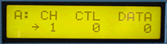

# Programmable Controllers

Programmable Controllers can transmit three seperate continuous controller messages on three channels. The controller messages can all be sent out one channel as well, or two different controllers can be sent out one channel with another sent on a second channel...

This MIDItool is especially useful for multitrack control of volume or pan, lighting or MIDI effects processing.

*Mouse over the buttons, LEDs, and potentiometer to see what they do.*

**HOW DO I...**

**...SELECT A CONTROLLER?**
Press the desired CONTROLLER SELECT key: A, B or C.
One of three independent controllers is selected for
programming and/or use.

**...SET THE SELECTED CONTROLLER'S TRANSMIT CHANNEL?**
Press the SETUP CHAN key. The MIDI transmit channel is set using the +/- keys and/or the VALUE fader.

**...SET THE SELECTED CONTROLLER'S NUMBER?**
Press the SETUP CTL key. The controller number is assigned using the +/- keys and/or the VALUE fader.

**...TRANSMIT MESSAGES USING THE SELECTED CONTROLLER?**
Press the DATA key. The VALUE fader and/or the +/-
keys are used to transmit MIDI controller messages.
The LCD gives all parameters and transmitted data
values for the selected controller.

Generated data are merged with incoming MIDI messages.

**LCD Screen:**

The cursor arrow points to the parameter that will be
modified by the +/- keys and VALUE fader.

\|x: CH CTL DATA\| where x=A,B or C, nn=1-16,
\| nn bbb bbb\| bbb=0-127
