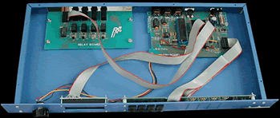
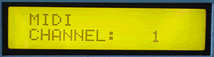

# Relay Driver

The Relay Driver MIDItool uses controller messages to turn relays on and off. Any controller messaage (from 1 - 120) can be assigned to all or one of four relays. A controller value greater than 64 turns the relay on, and less than 64 turns it off. This project requires the Relay Driver expansion board.

Use the Relay Driver to control any equipment that can be switched via a relay. Multimedia shows are particularly well suited to this project. Create a MIDI controlled house. Switch tape decks, projectors, lights...

PLEASE NOTE: the relays included with this project are rated at 30 Watts max. Do not use for higher loads. If a higher power rating is required use the Relay Driver to switch larger relays. The Relay Driver MIDItool also comes in an 8 relay configuration.

*Mouse over the buttons, LEDs, and potentiometer to see what they do.*


**HOW DO I...**

**...SET THE GLOBAL MIDI RECEIVE CHANNEL?**
Press the SETUP CHAN key. The global receive channel is selected using the + key and/or the VALUE fader. **

...SELECT A RELAY TO CONFIGURE?**
Press the SELECT key (A, B, C or D) to select a relay for configuration and/or manual use. **

...ASSIGN A CONTROLLER NUMBER TO EACH RELAY?**
Press the SETUP CTL key. The MIDI Controller number used to control the selected relay is assigned using the + key and/or the VALUE fader. For proper operation, each relay must be assigned to a unique controller number.
**
...USE CONTROLLERS TO AUTOMATICALLY TRIGGER RELAYS?**
For the assigned MIDI Controller, appropriate values manipulate each relay as follows:

Controller Value Action
------------------------
less than 64 closes relay
64 or higher opens relay

The corresponding RELAY CLOSED LED lights while the relay is closed.

**...MANUALLY CONTROL RELAYS?**
Press the TOG key. The currently selected relay will change state.

**LCD Screen:**



When the selecting the global receive channel,
\| MIDI \| where nn = 1-16
\| CHANNEL: nn

When configuring and operating relays,

\| -A- -B- -C- -D-\| where bbb = 0-120
```
| bbb bbb bbb bbb|
```
The cursor arrow points to the relay that will be
modified by the + key, VALUE fader, or TOG key.
