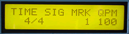

# Sequencer Remote Control

The Sequencer Remote Control is just what its name implies. Tell your sequencer to play, stop, rewind, continue, fast forward, loop, or go to an allocution point. This user friendly MIDItool is great for drummers or guitar players needing to lay down tracks or start a song. Use it in loop mode to practice difficult passages...

*Mouse over the buttons, LEDs, and potentiometer to see what they do.*
 **HOW DO I...**

**...PREPARE MY SEQUENCER?**
Following the sequencer's instruction manual, enter CHASE LOCK MODE.

**...CONFIGURE THE REMOTE CONTROL FOR MY SEQUENCE?**
Press the SETUP key. The time signature is entered using the NUM and DEN keys. The song tempo is entered with the VALUE fader. Fader function is indicated by the FADER LEDs. Tempo is given in quarter notes per minute (QPM).

**...PLAY THE SEQUENCE FROM THE BEGINNING?**
Press the START key. The sequence plays from the first measure. The tempo can be adjusted during playback with the +/- keys. While playing, the LCD gives the current song measure and beat.

**...STOP THE SEQUENCER?**
Press the STOP key. The LCD gives the last song measure and beat.

**...SHUTTLE THE SEQUENCER TO A SPECIFIC MEASURE?**
While stopped, the user can move to any measure using the +/- keys and/or the VALUE fader. Song position can be set to any measure between 1-256. Fader function is indicated by the FADER LEDs.

**...CONTINUE PLAYBACK FROM THE CURRENT MEASURE?**
Press the CONT key. The sequence will play from the current measure. While playing, tempo can be adjusted with the +/- keys. The LCD gives the current song position.

**...USE THE MARKER TO SAVE A MEASURE NUMBER?**
At any time, pressing the MARK key will save the current song measure number for jumping or looping. The LCD gives the number of the marked measure.

**...JUMP TO THE MARKED MEASURE AND CONTINUE PLAYBACK?**
While the sequencer is stopped, press the JUMP key. The sequencer will jump to the marked measure and resume playback.

**...ENTER LOOP PLAY MODE?**
While the sequence is playing, press the JUMP key. The sequence will loop continuously between the marked measure and the current measure. The loop starting measure is given in the LCD MRK display.

**LCD Screen:**

When the SETUP key is pressed,

\|TIME SIG MRK QPM\| where nn=1-16, dd=1,2,4,8 ;
\| nn/dd eee bbb\| or 16, bbb=20-255, eee=1-256 ;

When any other key is pressed,

\|status MRK QPM\| where eee=1-256, ff=1-16,
\|eee:ff eee bbb\| bbb=20-255, status="PLAYING",
"STOPPED", "LOOPING" or
"...wait"
