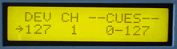

# MIDI Show Controller

The MIDI Show Controller maps MIDI Program change commands to MIDI Show Control GO commands. The unit has two modes: Edit mode, and Run mode. In Edit Mode the user can select MSC Device ID, and map program change commands to MSC cue ranges. In run Mode the LCD shows recieved Program Change commands and transmitted MSC commands.

*Mouse over the buttons, LEDs, and potentiometer to see what they do.*
 **HOW DO I...**

**...SELECT DEVICE ID?**
Press button 1 and increment or decremnt using the fader or up/down buttons.

**...SELECT MIDI CHANNEL?**
Press button 2 and increment or decremnt using the fader or up/down buttons.

**...SELECT MSC CUE RANGE?**
Press button 3 and increment or decremnt using the fader or up/down buttons.

**...SET CUE RANGE?**
Press the MESSAGE CLEAR key. All three bytes are reset to their inactive state.

**...ENTER EDIT MODE?**
Press button 5.

**...ENTER RUN MODE?**
Press button 6.

LCD Screen:

Edit Mode:

\| DEV CH --CUES--\| where nn=1-16
\| ddd nn ccc-cccc\| ddd=0-127

Run Mode:

\| CH PRG CUE \| where nn=1-16
\| nn ppp cccc \| ppp=0-127; cccc=0-1023
