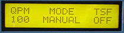

# Tap Tempo Transmitter

Use the Tap Tempo Transmitter to control sequence playback tempo by tapping a button on the MIDItools®. Synchronize humans and machines, or remotely control a sequencer with the auto-play feature. Sync a drum machine to instrumental tracks, or play conductor to your sequencer.

*Mouse over the buttons, LEDs, and potentiometer to see what they do.*
 **HOW DO I...**

**...PREPARE MY SEQUENCER?**
Following the sequencer's instruction manual, enter
CHASE LOCK MODE or MIDI SYNC MODE.

**...SET THE INITIAL (ESTIMATED) TEMPO?**
With the sequencer stopped, an estimate of the initial tempo should be entered with the +/- keys and/or the tempo fader.

**...START SEQUENCE PLAYBACK FROM THE BEGINNING?**
Press the START key. The sequencer will play from the first beat of the first measure. Continue playing the sequence by tapping the BEAT key once for each subsequent beat.

**...MANUALLY CONTROL THE TEMPO OF THE SEQUENCE?**
Press and release the BEAT key once for each beat. The user controls the sequence playback speed. The LCD gives the approximate tempo in quarter notes per minute (QPM).

**...ENABLE THE TEMPO SMOOTHING FUNCTION (TSF)?**
A tempo smoothing function can be enabled by pressing the TSF key. Smoothing function status is given in the LCD.

**...STOP THE SEQUENCER?**
Press the STOP key. The sequencer will stop at the end of the current measure. When stopped, the tempo can be modified using the +/- keys and/or tempo fader.

**...CONTINUE PLAYBACK FROM WHERE IT WAS STOPPED?**
Press the CONT key. The sequencer will start playing from the first beat of the current measure. Continue playing the sequence with the BEAT key, as above.

**...KNOW IF THE SEQUENCE IS STOPPED OR NOT?**
Playback status is indicated by the STOPPED and
PLAYING LEDs.

**...AUTOMATICALLY CONTROL SEQUENCE PLAYBACK?**
With the sequence playing, press the AUTO key. In AUTO mode, sequence playback is controlled automatically at the current tempo. Pressing the BEAT key at any time while autoplaying returns control to the user (MANUAL mode).

With the sequencer stopped, playback mode is changed each time the AUTO key is pressed. In AUTO mode, pressing START or CONT initiates automatic playback.

While autoplaying, the tempo can be modified with the +/- keys.

**LCD Screen:**

\|QPM MODE TSF\| where eee=20-255, vvv="ON"
\|eee ffffff vvv\| or "OFF", ffffff="MANUAL"
or "AUTO"
