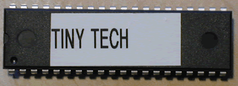

# Tiny Tech

Tiny Tech is a software program to aid you in diagnosing any problems you might have with your MIDItools® unit. It is shipped as an OTP (One Time Programmable) EPROM that you just pop into your assembled MIDItools®.

TinyTech will help you troubleshoot your MIDItools® Computer by helping you determine if any of the following components/modules are connected or assembled improperly: the liquid crystal display (LCD); the LCD backlight; the 8 pushbutton switches; the 16 LEDs; the A-to-D converter; the data potentiometer; the MIDI circuitry; and the EEPROM circuitry (if applicable).

**HOW DO I...**

The basic troubleshooting process is:

\[1\] Run each test in the order given.
\[2\] If the test results differ from those given in the manual, you have found a problem.
\[3\] Turn the power off.
\[4\] Study the components listed in the "Possible Problem Area" section of each test instruction.
\[5\] After you have found and corrected a suspected problem, repeat the failed test.

We sell the Tiny Tech at cost to MIDItools® purchasers because we believe it is an invaluable tool. Don't build a MIDItools® without one.

[Click here to view the Tiny Tech User Manual](../manuals/TinyTech.pdf)

