# Downloads

Downloads are organized into general MIDItools® documents followed by application binary files and application specific documents.

MIDITools®

Binary Application Files

Applications with Expansion Boards

<table data-border="1" data-bordercolordark="#000000" data-bordercolorlight="#333333" data-cellpadding="3" data-cellspacing="0" width="540">
<colgroup>
<col style="width: 25%" />
<col style="width: 25%" />
<col style="width: 25%" />
<col style="width: 25%" />
</colgroup>
<tbody>
<tr class="odd">
<td width="135"><a href="i/schematics/00029-SC.gif">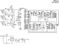 
CPU Board Schematic (.gif)</a></td>
<td width="135"><a href="i/manuals/00117cpu.pdf">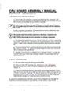 
CPU Board Assembly Manual (.pdf)</a></td>
<td width="135"><a href="i/schematics/00031-SC.gif">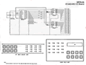 
Human Interface Board Schematic (.gif)</a></td>
<td width="135"><a href="i/manuals/RHUIRevB.pdf"> 
Rackmount Human Interface Board Assembly (.pdf)</a></td>
</tr>
<tr class="even">
<td width="135"><a href="i/manuals/00120han.pdf">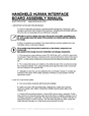 
Handheld Human Interface Board Assembly (.pdf)</a></td>
<td width="135"><a href="i/manuals/00116fin.pdf">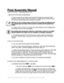 
Final Assembly Manual (.pdf)</a></td>
<td width="135"><a href="i/manuals/00123lcd.pdf">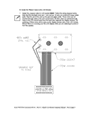 
LCD Assembly Manual (.pdf)</a></td>
<td width="135"></td>
</tr>
</tbody>
</table>

(use these file to burn your own 68HC05's)

Universal Transmitter [00003-sw.s19](i/MT_code/00003.txt)
Channel Message Transmitter [00004-sw.s19](i/MT_code/00004.txt)
Programmable Controllers [00005-sw.s19](i/MT_code/00005.txt)
Custom Instrument [00021-sw.s19](i/MT_code/00021.txt)
Tap Tempo Transmitter [00006-sw.s19](i/MT_code/00006.txt)
Sequencer Remote Control [00007-sw.s19](i/MT_code/00007.txt)
Data Monitor [00008-sw.s19](i/MT_code/00008.txt)
Relay Driver [00022-sw.s19](i/MT_code/00022.txt)
Control Thinner [00009-sw.s19](i/MT_code/00009.txt)
Channel Filter [00011.s19](i/MT_code/00010.txt)
Data Filter [00012-sw.s19](i/MT_code/00012.txt)
Channel Mapper [00013-sw.s19](i/MT_code/00013.txt)
Controller Mapper [00014-sw.S19](i/MT_code/00014.txt)
Keyboard Mapper [00015-sw.s19](i/MT_code/00015.txt)
Translating Randomizer [00016-sw.s19](i/MT_code/00016.txt)
Multi-Effector [00017-sw.s19](i/MT_code/00017.txt)
Sequencer Helper [00018-sw.s19](i/MT_code/00018.txt)
Chord Player [00019-sw.s19](i/MT_code/00019.txt)
System Exclusive Folder 00020-sw.s19
MIDI Patch Bay [00023-sw.s19](i/MT_code/00023.txt)
CV-to-MIDI [01324-sw.s19](i/MT_code/01324.txt)
64 or 128 Output Driver [00179-sw.S19](i/MT_code/00179.txt)
Quad Ektagraphic Projector Controller [00139-sw.s19](i/MT_code/00139.txt)
MIDItools® Messenger [01286-sw.s19](i/MT_code/01286.txt)
MIDI Show Controller [00010-sw.s19](i/MT_code/00010.txt)
Tiny Tech [00042-sw.s19](i/MT_code/00042.txt)

<table data-border="1" data-bordercolordark="#000000" data-bordercolorlight="#333333" data-cellpadding="3" data-cellspacing="0" width="540">
<colgroup>
<col style="width: 25%" />
<col style="width: 25%" />
<col style="width: 25%" />
<col style="width: 25%" />
</colgroup>
<tbody>
<tr class="odd">
<td width="135"><a href="i/manuals/00128ins.pdf">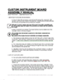 
Custom Instrument Board Assembly Manual (.pdf)</a></td>
<td width="135"><a href="i/manuals/00161opd.pdf">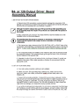 
64 or 128 Output Driver Board Assembly Manual (.pdf)</a></td>
<td width="135"><a href="i/manuals/00259opd.pdf">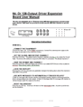 
64 or 128 Output Driver Board User Manual (.pdf)</a></td>
<td width="135"><a href="i/manuals/01326-AS.pdf">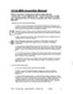 
CV-MIDI Assembly Manual (.pdf)</a></td>
</tr>
<tr class="even">
<td width="135"><a href="i/manuals/01323.pdf">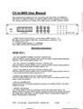 
CV-MIDI User Manual (.pdf)</a></td>
<td width="135"><a href="i/manuals/MTM%20Manual.pdf">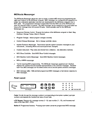 
MIDItools® Messenger User Manual (.pdf)</a></td>
<td width="135"><a href="i/manuals/00126rel.pdf">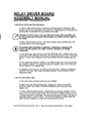 
Relay Driver Board Assembly Manual (.pdf)</a></td>
<td width="135"><a href="i/manuals/00127pat.pdf">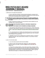 
MIDI Patch Bay Board Assembly Manual</a></td>
</tr>
<tr class="odd">
<td width="135"><a href="i/manuals/TinyTech.pdf">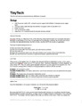 
Tiny Tech User Manual (.pdf)</a></td>
<td width="135"></td>
<td width="135"></td>
<td width="135"></td>
</tr>
</tbody>
</table>
