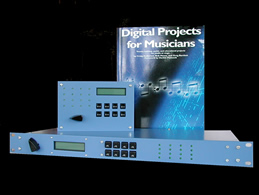

# MIDItools

 We are committed to bringing MIDItools® into the classroom. This commitment is based on our belief that MIDItools® provides the best solution for learning the fundamentals of music technology.

In an electronics classroom environment, a MIDItools® kit, coupled with the book Digital Projects for Musicians, teaches everything from soldering to an understanding of device architecture and programming. The fact that students are creating a musical device while they learn makes the process that much more entertaining.

In today's world few musicians can afford not to have a working knowledge of MIDI and electronics. For a musician, building a MIDItools® kit can be a revelation. Not only do they get to peek inside the box, but they actually get to build the box and make it work. This hands-on experience is vital to any studio musician, significantly increasing both competence and creativity. Aspiring composers and artistic technologists gain insight and are better equipped to implement their ideas.

Significant discounts are available for educators and educational institutions who use MIDItools® as a part of their curriculum. We provide free curriculum development assistance. Some student discounts are also available. Please email or call for specific information.
