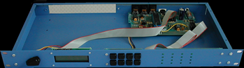
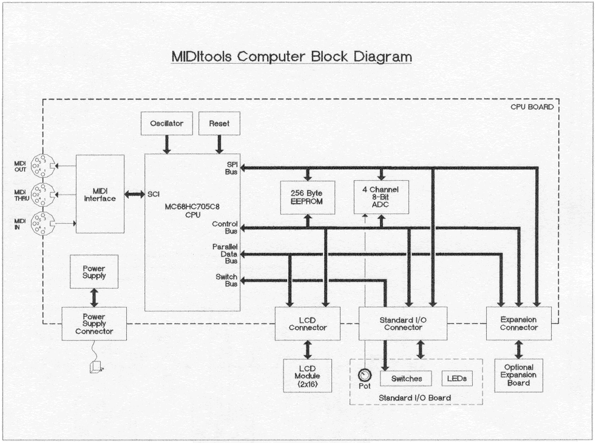

# MIDItools

- What Are They?
- How do they work?
- How do I get started?
- For Advanced Users

The MIDItools® computer is a generic hardware device designed to perform MIDI operations. It consists of a [chassis](../images/chassis.gif), a main board called the [CPU board](../images/cpu.gif), and a [front panel board](../images/frontpan.gif). The CPU board hosts a Motorola 6805 processor, a MIDI interface, some extra memory and an analog to digital converter. The front panel board contains 8 switches, 16 LED's, a potentiometer and an [LCD display](../images/lcdweb.gif). The CPU board also has sockets for connecting the front panel, LCD and an optional expansion board via ribbon cables. To gain an in depth understanding of the MIDItools® computer read Digital Projects for Musicians by Craig Anderton, Bob Moses, and Greg Bartlett.

MIDItools® is sold either as a [kit](../images/comkit.gif) or as an assembled unit. It comes in either a [rack mounted](../images/mtrmfb.gif) or [hand held](../images/handheld.gif) configuration. Once you know what application you want you simply choose the platform and place an order. We program the processor chip for you and send it with the kit or unit. The nice thing about MIDItools® is that once you have one, you actually have several devices. All you have to do is pop in a new processor chip, and you have a completely new tool.

MIDItools® were designed with two purposes in mind: one, to teach electronics and MIDI and two, to enable artistic technologists to create designs not tied to a computer. Check out the Applications, Catalog, User Projects and Educational Packages links to see the full potential of MIDItools®.

The brains of the MIDItools® computer is the Motorola 6805 microcontroller. Its ports connect to the switches, LCD, and other peripherals through four busses. Port A forms the Control bus which supplies on/off signals to the peripheral devices. The Data bus (port B) communicates parallel data to and from expansion boards and writes characters to the LCD display. Port C is the Switch bus which receives input from the front panel switches.

The SPI (Serial Peripheral Interface) bus originates from three special purpose pins of port D. This bus supplies serial data to turn the LED's on and off, receives data from the potentiometer, stores and retrieves data from external memory, and communicates with expansion boards.

In addition to the busses, the 68HC05 also communicates with the outside world through its SCI (Serial Communications Interface). This interface utilizes three different special purpose pins of port D. The SCI is an onboard [UART](../images/uart.gif) which sends and receives MIDI information supplied by the MIDI interface.

See the downloads section of this site for complete schematics and DO read Digital Projects for Musicians!

Start by deciding which MIDI application best suits your needs. You can do this by reviewing the Applications section of this site or reading Digital Projects for Musicians. If you have a specific application in mind not listed please visit our Custom Design page.

If you want to build the MIDItool yourself you'll need to be familiar with soldering techniques, identifying electronic parts and basic construction. Again, all of this is covered in the book.

Once you know which MIDItool you want you'll choose either the hand held or rack mounted version. If your application requires an expansion board you'll need the rack mounted platform by default.

Then just go to the catalog, choose your kits, and order. We'll program your chips and send your kit or assembled unit within three days. If you have any questions or need help don't hesitate to <a href="../contact.htm" target="_blank">contact</a> us.

The [Downloads](downloads.md) section of this site contains all of the binary application files so that you can burn your own EPROM's or OTP's. Schematics and User Manuals are available for download as well.

Please join the Yahoo MIDItools® discussion group. To sign up, send a blank email to this address: \<miditools-subscribe@yahoogroups.com\>.
