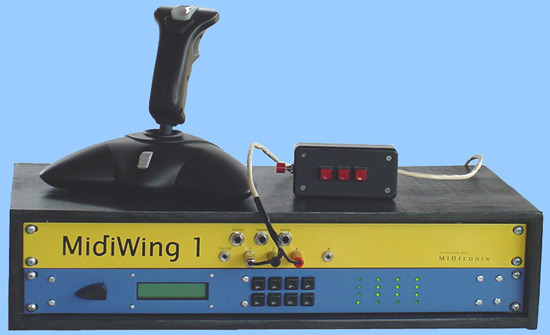
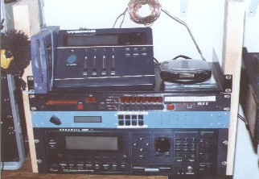
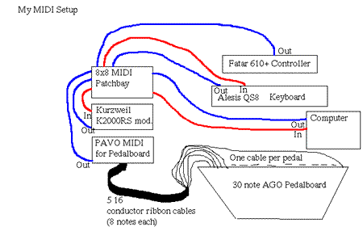
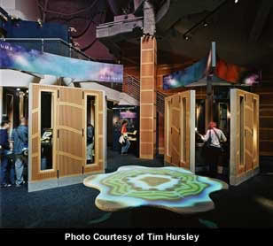

# User Projects

User Projects

Jeff Berryman of 

The Project: The Bryan Adams FOH mix kit is based around a Midas XL4 console and a string of MIDI-controlled effects devices.  The XL4's MIDI automation system is used to control the effects devices.  One of those devices, the legendary Lexicon 960L Digital Processor, responds on all 16 MIDI channels, effectively preventing other devices on the same MIDI chain from being controlled.  To work around this problem, Jasonaudio uses a MIDItools® Channel Filter to isolate the 960L from the rest of the chain.

Dan Daily

Great New Product:

Einar Ask

 

Bret Battey and James Jay

Mark Nichols

Adam Levin

Experienc Music Project, Seattle, Washington

### 

Two custom MIDItools® applications run continuously in the Sound Lab at EMP. One runs the MIDI channel routing for the Jamba Drum, shown in the foregroud of the above photo. The audio in each practic pod (9) is switched via a MIDItools® clock and master switch with a custom relay board.
